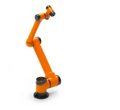
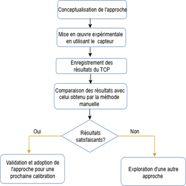

# Automatic Tool Center Point (TCP) Calibration for a 6-Axis Industrial Robot (AUBO-i10)

## Project Overview
This research project focuses on the development of an automated system for calculating the **Tool Center Point (TCP)** of a 6-axis industrial robot. Accurate TCP calibration is essential for robotic applications requiring high precision, such as industrial assembly, machining, and welding.

The proposed system aims to automate the TCP estimation process in order to reduce human intervention, improve calibration accuracy, and increase operational efficiency in industrial robotic environments.

## Problem Statement & Objectives
In industrial applications involving 6-axis robots, accurate TCP calibration is critical to ensure precise tool positioning. Traditional calibration methods are often time-consuming and highly dependent on operator expertise.

These limitations can lead to production downtime, recalibration delays, and reduced productivity.

The main objective of this project is to design and implement an **automatic TCP calibration system** capable of computing the TCP coordinates accurately while minimizing manual intervention and improving adaptability to different tool configurations.

## Existing TCP Calibration Methods
TCP calibration is a fundamental step in industrial robotics to ensure accurate tool positioning during manipulation, machining, and assembly tasks.

Traditional approaches generally rely on geometric calibration techniques using repeated robot poses. Common industrial methods include:

- 4-point calibration method  
- 6-point calibration method  
- 20-point calibration method  

Although these methods improve calibration accuracy, they often require multiple manual measurements and may depend heavily on the operator's experience.

## Proposed Measurement System
The developed TCP calibration system is based on a **laser displacement sensor** designed for precise and reliable tool detection.

The sensing structure integrates:

- Two laser emitters  
- Two **BPW77NA phototransistors**

These components are arranged in a **crossed-beam configuration** to improve detection robustness and measurement accuracy.

This configuration helps minimize the effects of incidence angle and surface reflectivity, allowing reliable detection of the tool position during robot motion.

During the calibration process, the system records the robot coordinates while the tool moves through the sensing area, enabling the computation of the TCP position.

## System Communication

The collaborative robot AUBO i10 communicates with the computer via a TCP/IP connection using its IP address, allowing real-time exchange of robot data and control information.

The laser displacement sensor is directly wired to the robot through its digital inputs, enabling the robot controller to detect sensor signals during the TCP calibration procedure.

## Experimental Validation Workflow

The following workflow summarizes the experimental procedure used to validate the TCP calibration system.

  

## Applications
The proposed system can improve calibration efficiency in several industrial robotics applications, including:

- Robotic welding
- Precision assembly
- Industrial machining
- Automated manufacturing systems

## Project Context
This work was developed as a **final-year engineering research project (PFE)** in the field of robotics and intelligent electronic systems.

## Note
Due to confidentiality constraints related to the host company, the source code and detailed implementation of the system are not publicly available. This repository provides only a high-level overview of the project and its research objectives.

## Author 

Wissal Hlioui | Electronics Engineer 

AI Enthusiast 